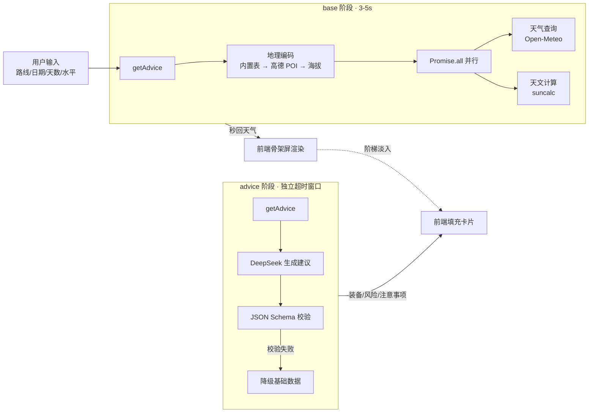

<div align="center">


# 徒步薯 Trekking Potato

<p><strong>大自然没给你带说明书，薯仔带了。</strong></p>

<p>输入一条徒步路线，几秒内拿到天气窗口、AI 装备清单、分级风险提示和晨昏光影时刻。</p>


<sub>一个面向中文徒步爱好者的 AI 行前建议工具。把「出发前查三天攻略」压缩成「打开小程序等十秒」。</sub>

</div>

---

## 为什么做这个

每次徒步出发前，装备查、天气查、日出日落查、风险评估查……攻略散落在十几个 App 和帖子里。徒步薯想把这些一次拼好：你只要告诉它去哪、什么时候去、走几天、自己什么水平，剩下的交给 AI。

它也是一个完整的**全栈 AI 应用练手项目** —— 从 LLM 结构化输出、云函数超时治理，到坐标纠偏和防御性编程，每一层都踩过真实的坑。

## 截图

<!-- 建议截图说明：用微信开发者工具截图，存到 docs/screenshots/ 目录，替换下方注释 -->
<!--
| 首页表单 | 天气窗口 | AI 装备清单 | 风险提示 |
|:---:|:---:|:---:|:---:|
|  |  |  |  |
-->

> 截图待补充 —— 这是目前 README 最该补的一块。用微信开发者工具截 3-4 张关键界面（首页表单 / 天气窗口 / AI 装备清单 / 风险提示），存到 `docs/screenshots/`，然后取消上方注释块。

## 核心特性

- **天气窗口** — 多日温/降水/风速预报，含海拔修正与逆温层提醒，第 5 天后自动标注置信度递减
- **AI 装备清单** — 按「必备 / 推荐 / 可选」三级分类，每件装备附带推荐理由，按能力等级动态注入约束
- **分级风险提示** — 致命级风险红色高亮 + 摇头动效，普通风险橙色提示
- **晨昏光影时刻** — 日出日落、黄金时刻、蓝调时刻，纯离线天文计算
- **历史记录** — 基于 openId 自动隔离，支持一键回填，过期日期自动重置
- **UGC 路线共创** — 手动坐标查询成功后静默落库，后续用户可直接搜到；Haversine 地理围栏去重
- **三级降级链** — LLM 正常用 AI 结果；LLM 超时用规则引擎兜底；全部失败时明确标红告知，绝不隐藏错误

## 技术架构



### 工程亮点

这些是开发中真正踩过的坑，也是项目最有技术含量的部分：

**两阶段加载（绕开云函数 20s 超时）**
把请求拆成 base / advice 两步：base 阶段只做地理编码 + 天气 + 天文，3-5 秒返回首屏；advice 阶段独立跑大模型，不阻塞。即使 AI 超时，用户也已拿到天气。

**GCJ-02 → WGS84 坐标转换**
高德 POI 返回 GCJ-02 火星坐标，Open-Meteo 用 WGS84。不转换会导致海拔查询偏差 100-300m，天气数据对应到错误的山头。`geocode.js` 内置了解密算法。

**LEVEL 动态注入（防 LLM 幻觉）**
JS 层根据能力等级拼接唯一约束段，不在 prompt 里堆 if-else 分支，让大模型更稳定地服从分级要求。

**防御性编程清单**
温度 `floor(min)` / `ceil(max)` 防零温差 Bug；海拔 0 falsy 防御（`elev != null`）；iOS Date 安全构造（`split` + `new Date`）；编辑距离匹配仅对 4 字以上查询启用（防「雪宝顶」误匹配「船底顶」）。

**凭据安全**
所有 API Key 只存云函数环境变量，代码零硬编码。

## 技术栈

| 层 | 技术 |
|---|---|
| 前端 | Taro 4.0.9 + React 18 + NutUI React Taro 3 |
| 后端 | 微信云开发 CloudBase（Node.js 云函数） |
| AI | DeepSeek `deepseek-chat`（OpenAI 兼容格式，`json_object`） |
| 天气 | Open-Meteo Forecast API（免费，含海拔修正） |
| 地理编码 | 175 条内置路线 + UGC 共创库 + 高德 POI 搜索 + 手动坐标兜底 |
| 天文 | suncalc（纯 JS 离线计算，手动 UTC+8） |
| 数据库 | 微信云数据库（MongoDB，openId 自动隔离） |
| 测试 | 27 个单元测试，零网络依赖 |

## 快速开始

### 前置条件

- Node.js 18+
- 已注册的微信小程序 AppID
- 已开通的微信云开发环境
- DeepSeek API Key
- 高德开放平台 Web 服务 Key（用于 POI 搜索）

### 安装

```bash
git clone https://github.com/JettxonHo/trekking-potato.git
cd trekking-potato/taro-app
npm install
```

云函数依赖需单独安装：

```bash
cd cloudfunctions/getAdvice && npm install && cd ../../
cd cloudfunctions/history && npm install && cd ../../
```

### 配置

1. 在 [src/app.js](./taro-app/src/app.js) 填入云开发环境 ID：`Taro.cloud.init({ env: '你的环境ID' })`
2. 在微信开发者工具中，为 `getAdvice` 云函数配置环境变量 `LLM_KEY`（DeepSeek API Key）
3. 高德 API Key 配置在 [cloudfunctions/getAdvice/geocode.js](./cloudfunctions/getAdvice/geocode.js) 的 `AMAP_KEY` 常量

### 本地开发

```bash
npm run dev:weapp
```

用微信开发者工具打开 `taro-app/` 目录（`project.config.json` 已配置 `miniprogramRoot` 指向 `dist/`）。基础库建议设为 **3.10.3**（非灰度版本）。

### 部署云函数

右键 `cloudfunctions/getAdvice` 和 `cloudfunctions/history` → 上传并部署：云端安装依赖。

### 测试

```bash
node scripts/unit-test.js
```

覆盖路线匹配、装备规则、坐标转换、边界海拔等，27/27 全绿，无网络依赖。

## 项目结构

```
.
├── taro-app/                  # 前端 + 云函数源码
│   ├── src/
│   │   ├── pages/index/       # 主页面：表单 → Loading → 结果三态
│   │   ├── styles/            # 设计令牌 + NutUI 主题覆盖
│   │   └── assets/            # Logo
│   ├── config/                # Taro 构建配置
│   └── project.config.json
├── cloudfunctions/            # 云函数（实际部署入口）
│   ├── getAdvice/             # 核心建议引擎
│   │   ├── index.js           # base/advice 分步调度
│   │   ├── geocode.js         # 地理编码 + GCJ02→WGS84
│   │   ├── weather.js         # Open-Meteo 天气（含海拔修正）
│   │   ├── sun-events.js      # 天文事件计算
│   │   ├── gear-rules.js      # 装备规则引擎（降级兜底）
│   │   ├── prompt.js          # LLM Prompt 构建 + 降级响应
│   │   └── data/routes.js     # 内置热门路线坐标表
│   └── history/               # 历史记录 + UGC 路线库
├── scripts/                   # 单元测试 + E2E 脚本
├── docs/                      # Spec / Plan / Tasks
└── miniprogram/               # 早期原生版本（已迁移至 Taro）
```

## 设计系统

视觉语言：**Notion 杂志底色 + Apple/Gemini 风格 + 薯仔搞怪彩蛋 + 果冻弹性动效**。

纯白背景 + 浅灰卡片（`#f5f5f7`）+ 哑光黑文字（`#1d1d1f`）；极弥散阴影，无边框设计；果冻弹性曲线 `cubic-bezier(0.68, -0.6, 0.32, 1.6)`，点击缩放 + 微旋转；卡片阶梯淡入，每张延迟 80ms。Loading 阶段用骨架屏 + 薯仔趣味文案轮播（如「薯仔正在和风谈判」「薯仔正在给太阳充电」）。

设计令牌定义在 [src/styles/theme.css](./taro-app/src/styles/theme.css)。

## Roadmap

- [x] 175 条内置路线 + UGC 共创
- [x] DeepSeek AI 建议 + 三级降级链
- [x] 历史记录持久化（openId 隔离）
- [ ] 离线模式：缓存上次查询的完整结果
- [ ] 多语言支持（英文界面）
- [ ] 路线难度社区评分系统
- [ ] iOS / Android 原生壳（Taro 跨端编译）

## 参与贡献

欢迎提交 Issue 和 PR。一些适合入手的方向：

- **补充路线数据**：`cloudfunctions/getAdvice/data/routes.js` 需要更多小众路线坐标
- **装备规则引擎**：`gear-rules.js` 的季节 x 海拔 x 天数 x 纬度矩阵可以更细
- **UI / 动效**：设计系统在 `src/styles/`，欢迎优化视觉体验
- **Bug 反馈**：实际徒步中使用遇到的问题最有价值

```bash
git checkout -b feat/your-feature
node scripts/unit-test.js
git commit -m "feat: 描述你的改动"   # 遵循 Conventional Commits
```

## 文档

- [Spec](docs/Spec.md) — 产品需求与技术规范
- [Plan](docs/Plan.md) — 技术实现计划
- [Tasks](docs/Tasks.md) — 任务清单
- [taro-app/README.md](taro-app/README.md) — 子目录详细文档

## License

[MIT](LICENSE)
