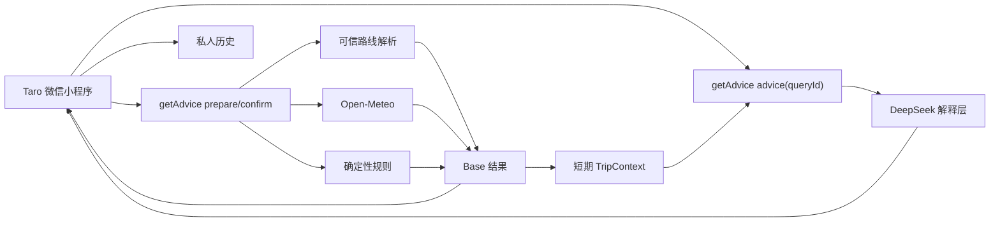

<div align="center">


# 徒步薯 Trekking Potato

**基于可信路线、明确时间窗口和确定性规则的徒步行前可行性检查工具。**

微信小程序 · Taro 4.0.9 · React 18 · CloudBase · Open-Meteo · DeepSeek

</div>

## 项目状态

项目正在执行 `TP-BETA-001`，目标是交付代码层面的核心闭测就绪版本。M1–M6 已完成：可信路线、
小时天气、确定性结论、服务端 `queryId`、结构化结果、私人历史和显式恢复流程均已合并。当前处于
M7/I24c 本地证据与最终文档阶段；自动化五试点验收已完成，DevTools 运行时证据按实际工具可用性记录，
部署、真实闭测和生产发布仍不属于本 Goal。

- 当前产品入口：`taro-app/`
- 云函数：`cloudfunctions/getAdvice/`、`cloudfunctions/history/`
- `miniprogram/`：早期原生原型，不是当前生产界面
- 当前 Goal：[GOAL.md](GOAL.md)
- 当前状态：[docs/current-status.md](docs/current-status.md)
- Beta 验收清单：[docs/beta-acceptance-checklist.md](docs/beta-acceptance-checklist.md)
- Beta 验收报告：[docs/beta-acceptance-report.md](docs/beta-acceptance-report.md)

部署、真实闭测和生产发布不属于当前 Goal。

## 产品边界

用户选择具体路线、日期、每日出发时间和能力条件后，系统先显示可信路线事实、活动时段天气、最低装备和确定性结论；AI 随后异步解释，但不能修改这些事实。

结论为：建议出发、谨慎出发、暂不建议，或在数据不足时明确显示暂无法判断。它不是官方预警、专业向导、医疗建议、救援服务或行中导航。

## 当前能力

- Open-Meteo 多日天气，严格对应出发日期与行程天数，风速固定为 `m/s`
- `trek / climb / tour` 类型贯穿解析、规则、Prompt、响应、缓存和历史
- 确定性装备规则与 AI 降级
- GCJ-02 到 WGS84 坐标转换
- 日出、日落和晨昏时刻计算
- 微信 openid 隔离的私人历史基础

公共 UGC 当前不属于可信产品方向。手动坐标查询不会在新 Goal 中静默写入公共路线库。

## 技术架构


```mermaid
flowchart LR
  UI["Taro 微信小程序"] --> PREPARE["getAdvice prepare/confirm"]
  PREPARE --> ROUTE["可信路线解析"]
  PREPARE --> WEATHER["Open-Meteo"]
  PREPARE --> RULES["确定性规则"]
  ROUTE --> BASE["Base 结果"]
  WEATHER --> BASE
  RULES --> BASE
  BASE --> UI
  BASE --> CTX["短期 TripContext"]
  UI --> ADVICE["getAdvice advice(queryId)"]
  CTX --> ADVICE
  ADVICE --> LLM["DeepSeek 解释层"]
  LLM --> UI
  UI --> HISTORY["私人历史"]
```

目标架构与稳定契约见 [docs/architecture.md](docs/architecture.md)。尚未合并的 Goal 能力不会在 README 中宣称已完成。

## 当前本地使用

### 前置条件

- Node.js 24 LTS（版本由根目录 [`.node-version`](.node-version) 固定）与 npm 10.9.2
  （由根 `packageManager` 和 Corepack 固定）
- 微信开发者工具与小程序 AppID
- 微信云开发环境
- DeepSeek `LLM_KEY`
- 高德 Web 服务 `AMAP_KEY`

### 安装

从仓库根目录执行：

```bash
corepack npm ci
corepack npm run bootstrap
```

根 `bootstrap` 会按顺序为 `taro-app/`、`cloudfunctions/getAdvice/` 和
`cloudfunctions/history/` 执行各自的 `npm ci`。项目不使用 npm workspaces，
以保留 CloudBase 云函数的独立部署语义。

请不要用 Node 24 随附的 npm 11 执行安装：`.npmrc` 的 `engine-strict` 会提前
拒绝它。`@nutui/nutui-react-taro@3.0.20` 声明了已不可解析的可选依赖，npm 11
生成锁文件时会省略该包、而 `npm ci` 又将其视为锁文件缺失；本项目因此固定在
npm 10.9.2，未升级或替换 NutUI。

### 配置

- `taro-app/src/app.js` 当前包含云环境 ID；将环境配置外置属于后续独立任务，不要提交真实生产凭据。
- `LLM_KEY` 和 `AMAP_KEY` 由云函数环境变量提供，不能硬编码进仓库。

### 开发与构建

```bash
cd taro-app
npm run dev:weapp
npm run build:weapp
```

用微信开发者工具打开 `taro-app/`，其 `project.config.json` 指向 `dist/`。

不要用仓库根目录的旧 `project.config.json` 作为当前入口；它仍指向历史原生 `miniprogram/`，后续将由独立工程清理任务处理。

## 本地质量门禁

```bash
corepack npm@10.9.2 run lint
corepack npm@10.9.2 run typecheck
corepack npm@10.9.2 test
corepack npm@10.9.2 run test:integration
corepack npm@10.9.2 run build:weapp
```

`test` 运行全部根级行为合同，包括路线、天气、判定、TripContext、公共响应、结构化结果和恢复流程。
`test:integration` 当前保留早期离线 E2E 基线；I24b 的 `test:beta-acceptance` 已覆盖当前五条
RouteVariant 的 `prepare/confirm → queryId → advice` 跨层验收，不把旧三路线管线冒充最终 Beta 纵向证据。
所有离线测试都使用 fixture/mock，不访问真实 Open-Meteo、CloudBase 或 DeepSeek。I24c 的 DevTools
交互和截图必须按实际运行时状态记录，不能用 CLI build 结果冒充视觉或导入证据。
`lint` 以 ESLint flat config 检查云函数、Taro 源码和脚本，`typecheck` 用 TypeScript
的 `allowJs`、`checkJs`、`noEmit` 与 `skipLibCheck` 检查两个云函数和 Taro 源码。
每个 Pull Request 还会运行同一组 GitHub `quality` 检查；`main` 要求通过 PR 和
该检查才能合并，并禁止 force push 与删除。

## 目录

```text
.
├── AGENTS.md                 # Agent 入口与硬规则
├── GOAL.md                   # 当前 Goal
├── taro-app/                 # 当前微信小程序前端
├── cloudfunctions/
│   ├── getAdvice/            # 路线、天气、规则和 AI 编排
│   └── history/              # 当前历史/旧 UGC，Goal 后收敛为私人历史
├── scripts/                  # 离线测试与审计脚本
├── docs/                     # 产品、架构、开发、测试和治理事实
└── miniprogram/              # 历史原生原型
```

## 协作

开发使用 `main + codex/<issue-id>-<slug>`、一 Issue 一 PR、squash merge。Issue 必须包含完整任务合同，执行 Agent不得批准自身 PR。详见：

- [产品需求](docs/product-requirements.md)
- [架构](docs/architecture.md)
- [开发计划](docs/development-plan.md)
- [测试策略](docs/testing-strategy.md)
- [Agent 协作](docs/agent-collaboration.md)
- [Issue 与 PR 流程](docs/issue-and-pr-workflow.md)
- [决策记录](docs/decision-log.md)

## License

[MIT](LICENSE)
