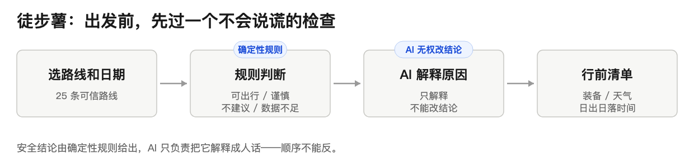
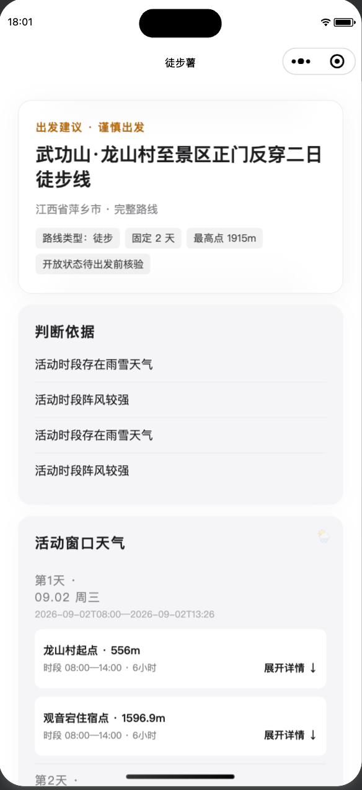
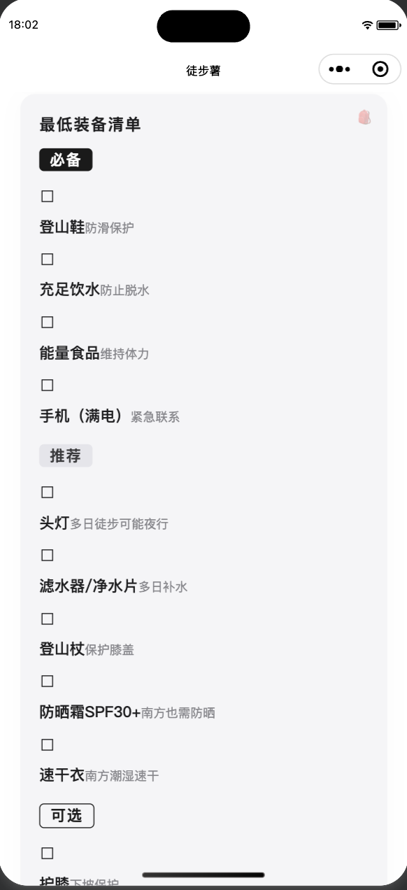
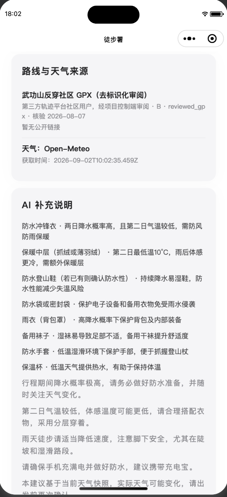
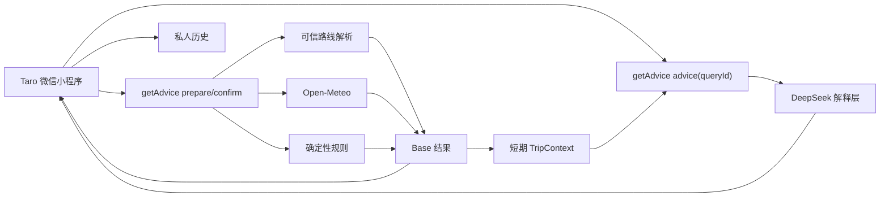

<div align="center">


# 徒步薯 Trekking Potato

**出发前，先过一个不会说谎的检查。**

[](LICENSE)


[快速开始](#快速开始) · [Issues](https://github.com/JettxonHo/trekking-potato/issues) · [决策记录](docs/decision-log.md)

</div>

> 这个项目回答的问题：**在安全攸关的场景里，AI 应该站在哪里？**——答案是靠边站：能不能出发由确定性规则判定，AI 只负责把结论解释给人听，顺序不能反。

## 目录

- [它是什么](#它是什么)
- [功能特性](#功能特性)
- [真实界面](#真实界面)
- [已验证事实](#已验证事实)
- [它和其他"AI 户外助手"的区别](#它和其他ai-户外助手的区别)
- [快速开始](#快速开始)
- [常见问题](#常见问题)

## 它是什么

徒步薯源于一次真实经历：党岭 13 小时、19 公里雪天折返。复盘发现行前的重复判断——路线难不难、天气行不行、装备够不够——完全可以结构化。

它是一个微信小程序：你选定路线、日期和出发时间，它先给你确定性规则算出的四态结论（**可出行 / 谨慎 / 不建议 / 数据不足**），AI 随后只把结论解释成人话，**不能修改结论**。它不是官方预警、专业向导、医疗建议、救援服务或行中导航。



## 功能特性

- **四态确定性结论**：可出行 / 谨慎出发 / 暂不建议 / 数据不足——由规则而非模型给出
- **多点小时级天气**：起点、途经点、住宿点分别对应活动时段的天气窗口
- **分级装备清单**：必备 / 推荐 / 可选三级，可按清单逐项核对
- **日出日落时间**：辅助判断"天亮前要不要出发"
- **GPX / KML 轨迹补全**：官方只有地点级参考的路线，可上传轨迹补全
- **私人历史**：微信账号隔离的查询记录，只有本人可见
- **AI 降级处理**：AI 不可用、超时或输出不合规时，结论与清单照常可用

## 真实界面

| 结论与依据 | 行前清单 | 来源透明 + AI 解释 |
|---|---|---|
|  |  |  |

微信开发者工具实机模拟（2026-09）：结论与判断依据由确定性规则给出；路线与天气来源逐条公开，AI 只生成解释。

## 已验证事实

> 截至 2026-09-02，与 `docs/` 验收记录口径一致。

| 事实 | 状态 |
|---|---|
| 可信路线目录 | 25 条可搜索完整路线（经来源逐条审阅），代码 / 数据就绪 |
| 安全机制 | 确定性规则出四态结论，DeepSeek 只生成解释；真实查询中安全结论未被模型覆盖 |
| Beta 验收 | 自动化门禁全部通过（合同 / 集成 / lint / 类型检查 / 构建）；DevTools 界面行为如实记为未验证，无真实用户 beta |
| 真实行为价值 | 本人在武功山出发前依据清单补带了头灯 |

## 它和其他"AI 户外助手"的区别

- **AI 无权改结论**：天气差、数据不足时规则直接说"不建议"或"无法判断"，AI 不能把它包装得更好听
- **数据不足就明说**：查不到可靠数据时显示"暂无法判断"，不硬编结论
- **每条路线都有出处**：路线事实带来源与核验时间，不接受无出处轨迹

## 快速开始

前置条件：Node.js 24 LTS（`corepack`）、微信开发者工具、微信云开发环境、DeepSeek 与高德 API Key。

```bash
corepack npm ci && corepack npm run bootstrap
cd taro-app && npm run dev:weapp
```

用微信开发者工具打开 `taro-app/`（其 `project.config.json` 指向 `dist/`）。

## 常见问题

**它可以替代官方天气预警吗？**
不能。它是行前自查工具，不是官方预警、专业向导或救援服务；遇到官方预警一律以官方为准。

**路线数据从哪来？**
来自公开社区轨迹（如 OpenStreetMap 关系数据），每条经来源审阅与版本核验后才进入目录；无出处的轨迹不会被收录。

**AI 会不会为了讨好我而把风险说轻？**
不会。AI 只拿到规则已经算好的结论做解释；它不接触决策权。AI 不可用时，结论和清单照常工作。

---

> 以下为开发与治理文档（原 README 内容保留不变，从"## 项目状态"开始）

## 项目状态

`TP-BETA-001` 已完成核心代码就绪，`TP-STAGING-001` 又以 `CONDITIONAL_GO` 完成受限 staging 验证。
当前 `TP-COMMUNITY-001` 已完成 C01–C05 的实现，C06 正在进行 owner→admin→retention/UI 的离线代码验收：
它只把经审核的轨迹变成几何证据，不自动发布路线，也不改变路线开放状态、天气、安全规则或出发结论。

`TP-CATALOG-001` 已于 2026-08-24 以 `COMPLETE — CATALOG_READY` 关闭：当前目录恰为 25 条可搜索 `full` 路线、1 条五台山限制（不计入）、缺口 0（Issue #167 closeout）。

## 一句话给访客

它不做"AI 建议你去哪"，而是把行前判断里**不能出错的部分交给确定性规则**，把"解释给人听"的部分交给 AI——顺序不能反。

- 当前产品入口：`taro-app/`
- 云函数：`cloudfunctions/getAdvice/`、`cloudfunctions/history/`
- 新云函数：`trackSubmission`（代码已实现并通过离线合同测试，尚未部署或做真实运行时验收）
- `miniprogram/`：早期原生原型，不是当前生产界面
- 当前 Goal：[GOAL.md](GOAL.md)
- 当前状态：[docs/current-status.md](docs/current-status.md)
- 社区轨迹 staging 验证记录：[docs/community-track-staging-validation.md](docs/community-track-staging-validation.md)
- Beta 验收清单：[docs/beta-acceptance-checklist.md](docs/beta-acceptance-checklist.md)
- Beta 验收报告：[docs/beta-acceptance-report.md](docs/beta-acceptance-report.md)
- Goal 完成报告：[docs/goal-completion-report.md](docs/goal-completion-report.md)

生产发布和公共社区不属于当前 Goal；`trackSubmission` 的 CloudBase 部署、定时清理和真实客户端/设备验收仍需
单独人工门禁，不能由离线测试或构建结果替代。

## 产品边界

用户选择具体路线、日期、每日出发时间和能力条件后，系统先显示可信路线事实、活动时段天气、最低装备和确定性结论；AI 随后异步解释，但不能修改这些事实。

结论为：建议出发、谨慎出发、暂不建议，或在数据不足时明确显示暂无法判断。它不是官方预警、专业向导、医疗建议、救援服务或行中导航。

## 当前能力

- Open-Meteo 多日天气，严格对应出发日期与行程天数，风速固定为 `m/s`
- `trek / climb / tour` 类型贯穿解析、规则、Prompt、响应、缓存和历史
- 确定性装备规则与 AI 降级
- GCJ-02 到 WGS84 坐标转换
- 日出、日落和晨昏时刻计算
- 微信 openid 隔离的私人历史基础

公共 UGC 当前不属于可信产品方向。新 Goal 只增加私有提交/管理员审核，不提供公共 feed 或 raw 下载；
任何获批轨迹仍需独立 catalog PR 才可能成为路线几何证据。手动坐标查询不会静默写入路线库。

## 技术架构


```mermaid
flowchart LR
  UI["Taro 微信小程序"] --> PREPARE["getAdvice prepare/confirm"]
  PREPARE --> ROUTE["可信路线解析"]
  PREPARE --> WEATHER["Open-Meteo"]
  PREPARE --> RULES["确定性规则"]
  ROUTE --> BASE["Base 结果"]
  WEATHER --> BASE
  RULES --> BASE
  BASE --> UI
  BASE --> CTX["短期 TripContext"]
  UI --> ADVICE["getAdvice advice(queryId)"]
  CTX --> ADVICE
  ADVICE --> LLM["DeepSeek 解释层"]
  LLM --> UI
  UI --> HISTORY["私人历史"]
```

目标架构与稳定契约见 [docs/architecture.md](docs/architecture.md)。尚未合并的 Goal 能力不会在 README 中宣称已完成。

## 当前本地使用

### 前置条件

- Node.js 24 LTS（版本由根目录 [`.node-version`](.node-version) 固定）与 npm 10.9.2
  （由根 `packageManager` 和 Corepack 固定）
- 微信开发者工具与小程序 AppID
- 微信云开发环境
- DeepSeek `LLM_KEY`
- 高德 Web 服务 `AMAP_KEY`

### 安装

从仓库根目录执行：

```bash
corepack npm ci
corepack npm run bootstrap
```

根 `bootstrap` 会按顺序为 `taro-app/`、`cloudfunctions/getAdvice/` 和
`cloudfunctions/history/` 执行各自的 `npm ci`。项目不使用 npm workspaces，
以保留 CloudBase 云函数的独立部署语义。

请不要用 Node 24 随附的 npm 11 执行安装：`.npmrc` 的 `engine-strict` 会提前
拒绝它。`@nutui/nutui-react-taro@3.0.20` 声明了已不可解析的可选依赖，npm 11
生成锁文件时会省略该包、而 `npm ci` 又将其视为锁文件缺失；本项目因此固定在
npm 10.9.2，未升级或替换 NutUI。

### 配置

- `taro-app/src/app.js` 当前包含云环境 ID；将环境配置外置属于后续独立任务，不要提交真实生产凭据。
- `LLM_KEY` 和 `AMAP_KEY` 由云函数环境变量提供，不能硬编码进仓库。

### 开发与构建

```bash
cd taro-app
npm run dev:weapp
npm run build:weapp
```

用微信开发者工具打开 `taro-app/`，其 `project.config.json` 指向 `dist/`。

不要用仓库根目录的旧 `project.config.json` 作为当前入口；它仍指向历史原生 `miniprogram/`，后续将由独立工程清理任务处理。

## 本地质量门禁

```bash
corepack npm@10.9.2 run lint
corepack npm@10.9.2 run typecheck
corepack npm@10.9.2 test
corepack npm@10.9.2 run test:integration
corepack npm@10.9.2 run build:weapp
```

`test` 运行全部根级行为合同，包括路线、天气、判定、TripContext、公共响应、结构化结果、恢复流程和
`trackSubmission` owner→admin→retention/UI 离线验收。`test:track-acceptance` 使用注入式内存边界，
不访问真实 CloudBase、存储或外部 API；每一项 staging/runtime 状态见独立验证记录。
`test:integration` 当前保留早期离线 E2E 基线；I24b 的 `test:beta-acceptance` 已覆盖当前五条
RouteVariant 的 `prepare/confirm → queryId → advice` 跨层验收，不把旧三路线管线冒充最终 Beta 纵向证据。
所有离线测试都使用 fixture/mock，不访问真实 Open-Meteo、CloudBase 或 DeepSeek。I24c 的 DevTools
交互和截图必须按实际运行时状态记录，不能用 CLI build 结果冒充视觉或导入证据。
`lint` 以 ESLint flat config 检查云函数、Taro 源码和脚本，`typecheck` 用 TypeScript
的 `allowJs`、`checkJs`、`noEmit` 与 `skipLibCheck` 检查两个云函数和 Taro 源码。
每个 Pull Request 还会运行同一组 GitHub `quality` 检查；`main` 要求通过 PR 和
该检查才能合并，并禁止 force push 与删除。

## 目录

```text
.
├── AGENTS.md                 # Agent 入口与硬规则
├── GOAL.md                   # 当前 Goal
├── taro-app/                 # 当前微信小程序前端
├── cloudfunctions/
│   ├── getAdvice/            # 路线、天气、规则和 AI 编排
│   └── history/              # 私人历史；旧公共 UGC 入口已停用
├── scripts/                  # 离线测试与审计脚本
├── docs/                     # 产品、架构、开发、测试和治理事实
└── miniprogram/              # 历史原生原型
```

## 协作

开发使用 `main + codex/<issue-id>-<slug>`、一 Issue 一 PR、squash merge。Issue 必须包含完整任务合同，执行 Agent不得批准自身 PR。详见：

- [产品需求](docs/product-requirements.md)
- [架构](docs/architecture.md)
- [开发计划](docs/development-plan.md)
- [测试策略](docs/testing-strategy.md)
- [Agent 协作](docs/agent-collaboration.md)
- [Issue 与 PR 流程](docs/issue-and-pr-workflow.md)
- [决策记录](docs/decision-log.md)

## License

[MIT](LICENSE)
