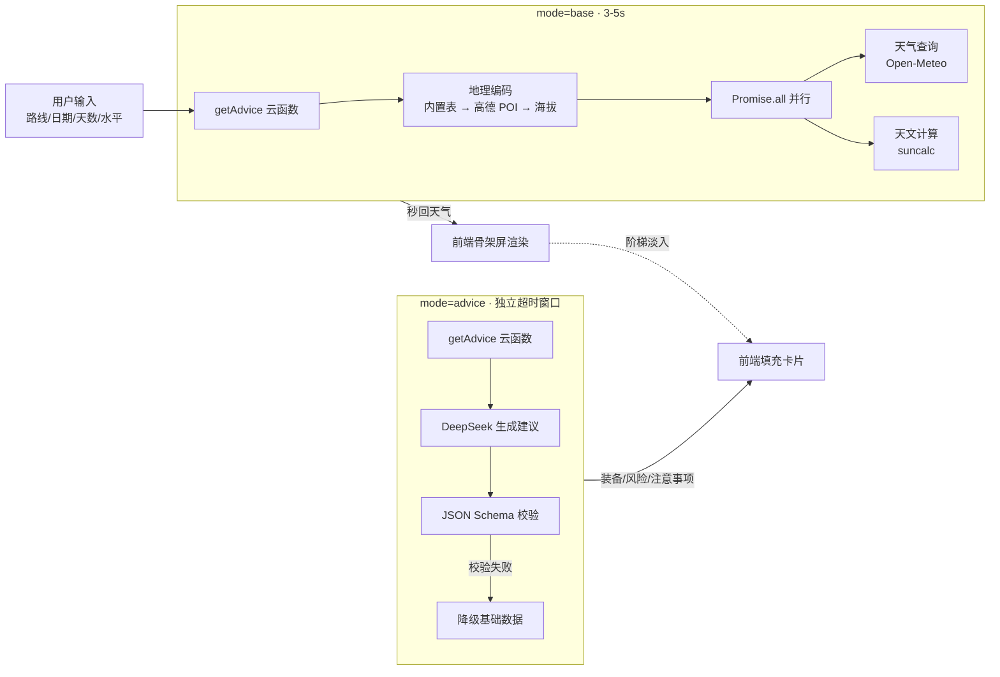

# 徒步薯 Trekking Potato

<p align="center">
  
</p>

<p align="center">
  输入一条徒步路线，几秒内拿到天气窗口、装备清单、风险提示和晨昏光影时刻。
</p>

<p align="center">
  
  
  
  
</p>

---

## 是什么

**徒步薯**是一个面向中文徒步爱好者的微信小程序。你给它一条路线（比如「武功山」）、出发日期、徒步天数和自己的徒步水平，它会：

1. 自动解析路线坐标与海拔
2. 拉取该海拔的多日天气预报
3. 计算日出、日落、黄金时刻、蓝调时刻
4. 调用大模型生成**装备清单**、**风险提示**和**行前注意事项**

目标是把「出发前查三天攻略」压缩成「打开小程序等十秒」。

## 核心特性

- **天气窗口** — 多日温/降水/风速预报，第 5 天后自动标注置信度递减，附海拔修正与逆温层提醒
- **AI 装备清单** — 按「必备 / 推荐 / 可选」三级分类，每件装备附带推荐理由
- **分级风险提示** — 致命级风险红色高亮 + 摇头动效，普通风险橙色提示
- **晨昏光影时刻** — 日出日落、黄金时刻、蓝调时刻，附带地形遮挡提醒
- **历史记录** — 基于微信 openId 自动隔离，支持一键回填（过期日期自动重置为今天）
- **UGC 路线共创** — 手动坐标查询成功后静默落库，后续用户可直接搜到该路线；地理围栏去重避免重复条目
- **手动坐标兜底** — 搜不到路线时，可直接粘贴经纬度查询
- **降级机制** — AI 不可用时自动降级为基础数据，明确告知用户而非隐藏错误

## 技术栈

| 层 | 技术 |
|---|---|
| 前端框架 | Taro 4.0.9 + React 18 |
| UI 组件库 | NutUI React Taro 3 |
| 构建 | Webpack 5 |
| 后端 | 微信云开发 CloudBase |
| AI 模型 | DeepSeek `deepseek-chat`（OpenAI 兼容格式） |
| 天气数据 | Open-Meteo |
| 地理编码 | 高德 POI 搜索 + 内置路线表 + UGC 库 |
| 天文计算 | suncalc |
| 语言 | JavaScript（JSX 类组件） |

## 架构



### 关键设计决策

**分步加载（base / advice 两阶段）**
微信云函数有超时限制。把请求拆成两步：`base` 阶段只做地理编码 + 天气 + 天文，3-5 秒内返回，前端立刻渲染天气卡片；`advice` 阶段独立调用大模型，用独立超时窗口跑，不阻塞首屏。这样即使 AI 超时，用户也已拿到天气数据。

**GCJ-02 → WGS84 坐标转换**
高德 POI 返回的是 GCJ-02 坐标，Open-Meteo 用 WGS84。如果不转换，海拔查询会偏差 100-300m，导致天气数据对应到错误的山头。`geocode.js` 内置了公开的 GCJ-02 解密算法做转换。

**JSON Schema 校验 + 降级**
大模型输出强制 `response_format: json_object`，返回后做 schema 校验：核心字段缺失则整体降级，非核心字段用默认值填充。降级时前端明确展示「薯仔脑子暂时短路了」横幅，不隐藏错误。

**openId 自动隔离的历史记录**
微信云开发 `db.add()` 会自动注入 `_openid`，配合数据库安全规则设为「仅创建者可读写」，无需自己实现鉴权。

**UGC 地理围栏去重**
用户手动输入坐标查询后，云函数用 Haversine 距离判断：与库中已有路线距离小于 1km 视为同一路线，拒绝新增；同名但距离大于 5km 的路线自动追加地区前缀。

## 快速开始

### 前置条件

- Node.js 18+
- 已注册的微信小程序 AppID
- 已开通的微信云开发环境
- DeepSeek API Key
- 高德开放平台 Web 服务 Key（用于 POI 搜索）

### 1. 安装依赖

```bash
cd taro-app
npm install
```

云函数依赖需要单独安装：

```bash
cd cloudfunctions/getAdvice
npm install

cd ../history
npm install
```

### 2. 配置环境变量

在微信开发者工具中，为 `getAdvice` 云函数配置环境变量：

| 变量名 | 说明 |
|---|---|
| `LLM_KEY` | DeepSeek API Key |

高德 API Key 配置在 `cloudfunctions/getAdvice/geocode.js` 的 `AMAP_KEY` 常量中。

云开发环境 ID 配置在 [src/app.js](./src/app.js) 的 `Taro.cloud.init({ env: '你的环境ID' })`。

### 3. 本地开发

```bash
npm run dev:weapp
```

然后用微信开发者工具打开本项目根目录（`project.config.json` 中已配置 `miniprogramRoot` 指向 `dist/`）。

### 4. 生产构建

```bash
npm run build:weapp
```

构建产物输出到 `dist/`。

### 5. 部署云函数

在微信开发者工具中，右键 `cloudfunctions/getAdvice` 和 `cloudfunctions/history`，选择「上传并部署：云端安装依赖」。

## 项目结构

```
taro-app/
├── config/
│   └── index.js              # Taro 构建配置（750 设计稿、webpack5）
├── src/
│   ├── app.js                # 入口：云开发初始化 + ConfigProvider
│   ├── app.config.js         # 小程序全局配置（页面注册、窗口样式）
│   ├── pages/
│   │   └── index/
│   │       ├── index.jsx     # 主页面：表单 → Loading → 结果三态视图
│   │       └── index.css     # 主样式（Notion 杂志底色 + 果冻动效）
│   ├── styles/
│   │   ├── theme.css         # 设计令牌（色阶、圆角、阴影、动效曲线）
│   │   └── nutui-override.css # NutUI 组件主题覆盖
│   └── assets/
│       └── new_logo.png
├── cloudfunctions/
│   ├── getAdvice/            # 核心云函数
│   │   ├── index.js          # 入口：base/advice 分步调度
│   │   ├── geocode.js        # 地理编码 + GCJ02→WGS84 转换
│   │   ├── weather.js        # Open-Meteo 天气查询（含海拔修正）
│   │   ├── sun-events.js     # 天文事件计算
│   │   ├── gear-rules.js     # 装备规则模板（降级兜底）
│   │   ├── prompt.js         # LLM Prompt 构建 + 降级响应
│   │   └── data/routes.js    # 内置热门路线坐标表
│   └── history/              # 历史记录 + UGC 路线库
│       └── index.js          # save/list/delete/saveRoute/listRoutes
├── babel.config.js
└── project.config.json       # 微信开发者工具配置
```

## 云函数 API

### getAdvice

| mode | 职责 | 耗时 |
|---|---|---|
| `base` | 地理编码 → 天气 → 天文，返回基础数据 | 3-5s |
| `advice` | 接收 base 数据 → 调用 DeepSeek → 校验 → 返回装备/风险/注意事项 | 10-30s |
| 无 mode | 兼容旧调用，全链路一次跑完 | - |

### history

| mode | 职责 |
|---|---|
| `save` | 存一条查询记录（`_openid` 自动注入隔离） |
| `list` | 查当前用户最近 20 条 |
| `delete` | 删除指定记录（仅能删自己的） |
| `saveRoute` | UGC 路线落库（地理围栏去重 + 重名保护） |
| `listRoutes` | 搜索 UGC 路线库（供 geocode 前置查询） |

## 设计系统

视觉语言：**Notion 杂志底色 + Apple/Gemini 风格 + 薯仔搞怪彩蛋 + 果冻弹性动效**。

- 纯白背景 + 浅灰卡片（`#f5f5f7`）+ 哑光黑文字（`#1d1d1f`）
- 极弥散阴影，无边框设计
- 交互采用果冻弹性曲线 `cubic-bezier(0.68, -0.6, 0.32, 1.6)`，点击时缩放 + 微旋转
- 卡片阶梯淡入，每张卡片延迟 80ms
- Loading 阶段用骨架屏 + 薯仔字符表情（如 `(•_•)`）做趣味文案轮播

设计令牌定义在 [src/styles/theme.css](./src/styles/theme.css)，NutUI 组件覆盖在 [src/styles/nutui-override.css](./src/styles/nutui-override.css)。

## License

MIT
